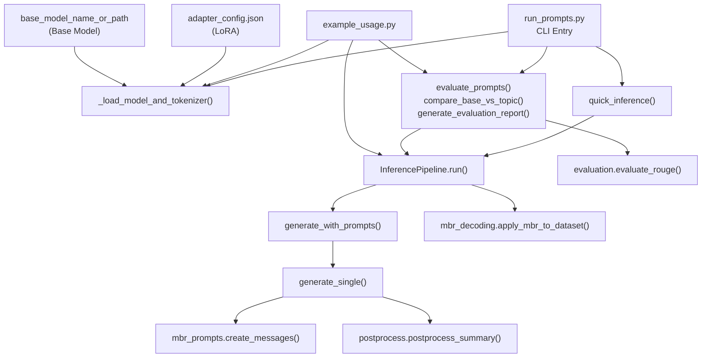

# 프롬프트 엔지니어링 - 한국어 다화자 대화 요약

한국어 다화자 대화 요약을 위한 프롬프트 엔지니어링 최적화 솔루션입니다.

## 📋 개요

이 프로젝트는 **train.csv**, **dev.csv**, **test.csv** 데이터 분석을 기반으로 SFT 학습, 추론, MBR 앙상블에 최적화된 프롬프트 전략을 제공합니다.

### 핵심 특징

- ✅ **검증된 Base 프롬프트** (ROUGE-1 0.56+ 달성)
- ✅ **8가지 프롬프트 변형** (MBR 앙상블용)
- ✅ **MBR 디코딩 알고리즘** (ROUGE 기반 후보 선택)
- ✅ **완전한 추론 파이프라인**
- ✅ **종합 평가 스크립트**

### 실측 성능

| 방법 | ROUGE-1 | 개선 |
|-----|---------|------|
| Greedy (1개 프롬프트) | 0.5641 | 기준 |
| MBR 8개 앙상블 | **0.5716** | **+0.0075 (+1.3%)** |

## 🗺️ 코드 관계도

아래 다이어그램은 `LLM` 폴더 기준 실행 흐름과 모듈 의존 관계를 보여줍니다.



### 클래스/핵심 함수 요약

- `run_prompts.py`
  - CLI 인자를 받아 모드(`inference/evaluate/compare/report`)를 분기합니다.
  - 모델 경로가 LoRA 어댑터인지(full model인지) 자동 판별해 로드합니다.
- `prompts/inference.py`
  - `InferencePipeline` 클래스가 추론 전체를 담당합니다.
  - `generate_single()`에서 프롬프트 생성 → 토크나이즈 → `model.generate()` → 후처리를 수행합니다.
  - `run()`에서 필요 시 `mbr_decoding.apply_mbr_to_dataset()`로 후보를 앙상블합니다.
- `prompts/evaluation.py`
  - 프롬프트별 ROUGE 평가, Base vs Topic 비교, 종합 리포트 생성을 담당합니다.
- `example_usage.py`
  - 위 로직을 함수별 예제로 묶어, 단일 추론/MBR 추론/평가를 빠르게 재현합니다.

## 🚀 빠른 시작

### 1. 설치

```bash
# 필요한 패키지 설치
pip install transformers torch trl datasets rouge mecab-python3
```

### 2. 추론 실행

#### 옵션 1: 빠른 추론 (단일 프롬프트)

```bash
python run_prompts.py \
    --mode inference \
    --model_path ./baseline_sft/baseline_ckpt \
    --test_file test.csv \
    --output_file submission_fast.csv \
    --prompt_variant oneshot # 이 커맨트 빼면 base가, 유형을 넣으면 해당 프롬프트가 실행 
```

**예상 시간**: ~5분 (RTX 3090 기준)

#### 옵션 2: MBR 앙상블 (최고 성능)

```bash
python run_prompts.py \
    --mode inference \
    --model_path ./baseline_sft/baseline_ckpt \
    --test_file test.csv \
    --output_file submission_mbr.csv \
    --use_mbr  # topic을 지정하지 않았으므로 topic은 실제로는 아무 동작을 하지 않음  
```

**예상 시간**: ~40분 (RTX 3090 기준)

#### 옵션 3: Topic 정보 활용 (+MBR)

```bash
python run_prompts.py \
    --mode inference \
    --model_path ./baseline_sft/baseline_ckpt \
    --test_file test.csv \
    --output_file submission_topic.csv \
    --use_mbr \
    --use_topic  
```

### 3. 평가 실행

#### Base vs Topic 비교

```bash
python run_prompts.py \
    --mode compare \
    --model_path ./response_only_SFT/r4b_response_only_ckpt \
    --dev_file dev.csv
```

#### 모든 프롬프트 변형 평가

```bash
python run_prompts.py \
    --mode evaluate \
    --model_path ./response_only_SFT/r4b_response_only_ckpt \
    --dev_file dev.csv
```

#### 종합 보고서 생성

```bash
python run_prompts.py \
    --mode report \
    --model_path ./response_only_SFT/r4b_response_only_ckpt \
    --dev_file dev.csv \
    --report_path evaluation_report.txt
```

## 📦 모듈 구조

```
prompts/
├── __init__.py              # 패키지 초기화
├── base_prompts.py          # SFT 학습용 Base 프롬프트
├── mbr_prompts.py           # MBR 앙상블용 8가지 변형
├── postprocess.py           # 후처리 함수
├── mbr_decoding.py          # MBR 디코딩 알고리즘
├── inference.py             # 추론 파이프라인
└── evaluation.py            # 평가 스크립트
```

## 🎯 프롬프트 전략

### Base 프롬프트

```python
SYSTEM_PROMPT = """당신은 한국어 대화 요약 전문가입니다.
대화에는 #Person1#, #Person2# 등의 화자 태그가 사용됩니다.
요약할 때 이 화자 태그를 그대로 사용하여 누가 무엇을 했는지 명확히 구분해주세요.
핵심 내용만 1~3문장으로 간결하게 요약하세요."""
```

### 8가지 프롬프트 변형 (MBR용)

1. **Base**: 검증된 기본 프롬프트 (가장 안정적)
2. **Abstract**: 추상적 표현 사용 (~에 대해 이야기한다)
3. **1-shot**: 예시 1개 포함 (형식 일관성)
4. **Topic**: 주제 정보 활용 (맥락 파악)
5. **Narrative**: 서술형 스타일 (행동 중심)
6. **QA Style**: 질의응답 형식
7. **3-shot**: 예시 3개 포함 (강력한 형식 학습)
8. **Base Copy**: Base와 동일 (안정성 확보)

### 예상 선택 빈도

```
Base (변형1,8)    : ~30-35%  (가장 안정적)
Abstract (변형2)  : ~18-20%  (스타일 다양성)
1-shot (변형3)    : ~15-17%  (형식 일관성)
Topic (변형4)     : ~12-15%  (맥락 활용)
Narrative (변형5)  : ~8-10%   (서술 스타일)
QA Style (변형6)  : ~5-8%    (질의 스타일)
3-shot (변형7)    : ~3-5%    (과도한 예시)
```

## 💻 Python 코드 사용 예시

### 추론

```python
from transformers import AutoModelForCausalLM, AutoTokenizer
from prompts.inference import InferencePipeline
import pandas as pd

# 모델 로드
model = AutoModelForCausalLM.from_pretrained(
    "./outputs/checkpoint-best",
    device_map="auto",
    torch_dtype="auto",
)
tokenizer = AutoTokenizer.from_pretrained("./outputs/checkpoint-best")

# 데이터 로드
test_df = pd.read_csv("test.csv")

# 추론 파이프라인
pipeline = InferencePipeline(model, tokenizer)

# MBR 앙상블 추론
predictions = pipeline.run(
    test_df=test_df,
    use_mbr=True,
    output_file="submission.csv"
)
```

### 평가

```python
from prompts.evaluation import compare_base_vs_topic
import pandas as pd

# Dev 데이터 로드
dev_df = pd.read_csv("dev.csv")

# Base vs Topic 비교
comparison = compare_base_vs_topic(dev_df, model, tokenizer)
print(comparison)
```

## 📊 성능 로드맵

| 단계 | 방법 | ROUGE-1 (예상) |
|-----|------|---------------|
| Baseline | 전체 시퀀스 SFT | 0.32 |
| Step 1 | Response-Only SFT + Base 프롬프트 | 0.56-0.57 |
| Step 2 | + Topic 프롬프트 | 0.565-0.575 |
| Step 3 | + MBR 8개 앙상블 | **0.570-0.575** |
| Step 4 | + 후처리 최적화 | 0.572-0.578 |
| **최종 목표** | **+ 모델 개선 (LoRA r=32, SimPO)** | **0.58-0.60+** |

## ⚙️ 핵심 설정

### SFT 학습

```python
from prompts.base_prompts import create_formatting_func, setup_response_only_loss
from trl import SFTTrainer, SFTConfig

# 포맷팅 함수
formatting_func = create_formatting_func(tokenizer, use_topic=False)
train_dataset = train_dataset.map(formatting_func)

# Response-Only Loss
collator = setup_response_only_loss(tokenizer, model_name="qwen")

# Trainer
trainer = SFTTrainer(
    model=model,
    train_dataset=train_dataset,
    data_collator=collator,
    max_seq_length=2048,
    # ... 기타 설정
)
```

### 추론 설정

```python
# Greedy 디코딩 (재현성 보장)
model.generate(
    **inputs,
    max_new_tokens=128,
    do_sample=False,
    pad_token_id=tokenizer.eos_token_id,
)
```

### 후처리

```python
from prompts.postprocess import postprocess_summary

# 기본 후처리
summary = postprocess_summary(raw_output)

# 고급 후처리 (대화 복사 감지, 문장 완결성 검증)
from prompts.postprocess import advanced_postprocess
summary = advanced_postprocess(raw_output)
```

## 🔍 주요 개선 사항

### 1. 화자 태그 정확성 (+ROUGE 직접 영향)
- ✅ `#Person1#`, `#Person2#` 반드시 유지
- ✅ 공백 정규화 (`#Person 1#` → `#Person1#`)

### 2. 간결성 (+0.005~0.01 ROUGE-1)
- ✅ 1-3문장으로 제한
- ✅ 불필요한 접두사 제거 ("요약:", "Summary:" 등)

### 3. Qwen3 특성 대응
- ✅ `<think>` 태그 제거
- ✅ `enable_thinking=False` 설정 필수

### 4. MBR 앙상블 (+0.0075 ROUGE-1)
- ✅ 8개 프롬프트 변형
- ✅ ROUGE 기반 최적 후보 선택
- ✅ MeCab 형태소 분석 적용

## 📝 예상 소요 시간 (RTX 3090 기준)

| 작업 | 시간 |
|-----|------|
| 단일 프롬프트 추론 (test.csv) | ~5분 |
| MBR 4개 앙상블 | ~20분 |
| **MBR 8개 앙상블 (권장)** | **~40분** |
| MBR 16개 앙상블 | ~80분 |
| Dev 평가 (단일 프롬프트) | ~2-3분 |
| Dev 평가 (8개 변형) | ~20-25분 |
| Dev 평가 (MBR 앙상블) | ~40-45분 |

## 🎓 참고 자료

- [RESEARCH.md](/Users/owy/Desktop/NLP1/RESEARCH.md) - 전체 연구 내용 및 실험 결과
- [프롬프트 엔지니어링 최적안 플랜](/.cursor/plans/프롬프트_엔지니어링_최적안_a122ed7c.plan.md) - 상세 설계 문서

## ⚠️ 주의사항

1. **Topic 정보 사용 시**
   - Topic이 너무 구체적이면 모델이 과도하게 의존
   - Test 데이터에 Topic이 없으면 일관성 문제 발생

2. **MBR 앙상블**
   - 8개가 비용 대비 효과 최적점
   - 16개로 늘려도 거의 향상 없음 (포화)

3. **Response-Only Loss**
   - 프롬프트 부분을 제외하고 어시스턴트 응답(summary) 구간만 Loss 계산
   - 학습 효율성 대폭 향상

4. **Thinking 모드**
   - `enable_thinking=False` 필수 (학습/추론 모두)
   - Qwen3 특성으로 간헐적 `<think>` 태그 생성 가능

## 🤝 기여

이 프로젝트는 비개발자도 이해할 수 있도록 설명이 작성되었습니다.
질문이나 개선 사항이 있으면 이슈를 열어주세요!

## 📄 라이선스

MIT License
